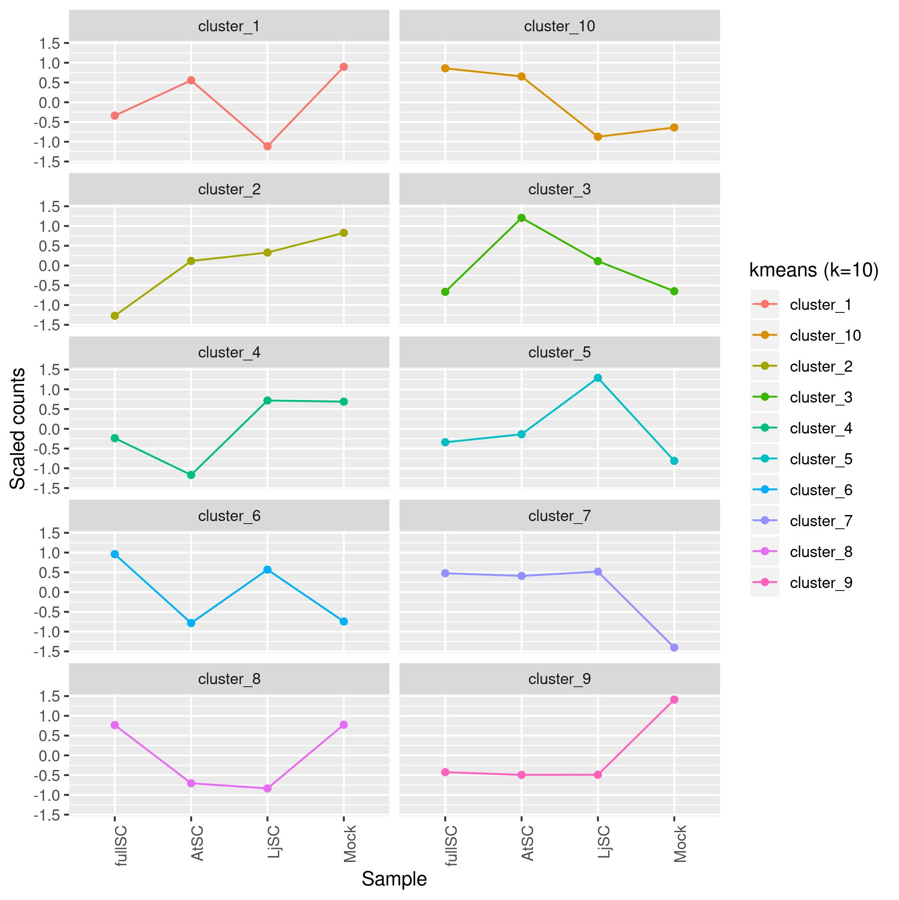
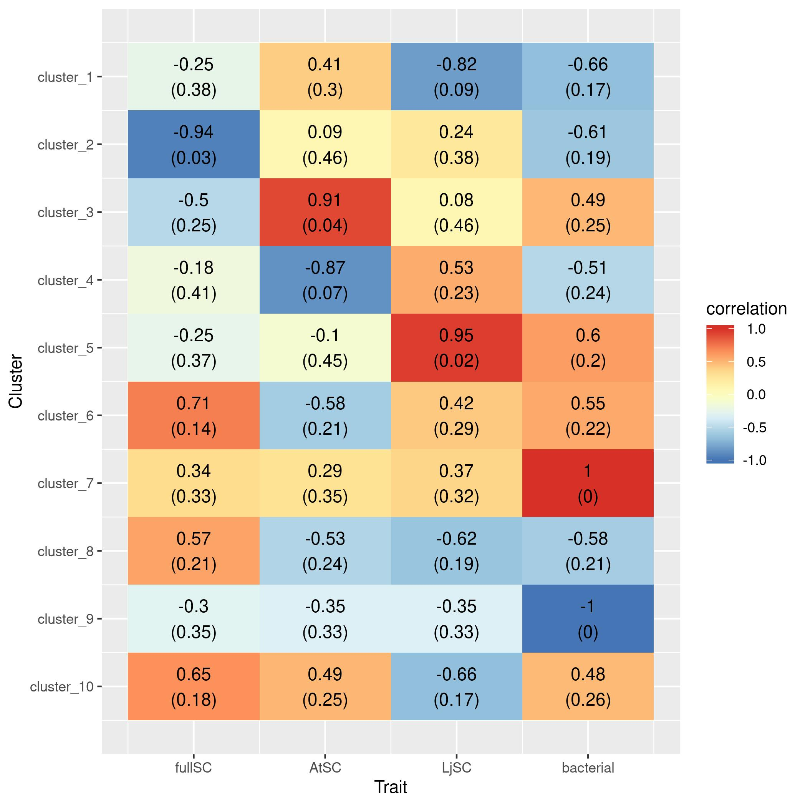

# RNA-Seq data from Kathrin Wippel #

<!-- content start -->

**Table of Contents**

- [1. Introduction](#1-introduction)
- [2. Progress](#3-progress)
    - [2.1 Alignment](#21-alignment)
    - [2.2 Cluster](#22-cluster)
- [References](#references)
    
<!-- content end -->
 
## 1. Introduction

Raw fastq files path `/biodata/dep_psl/grp_rgo/ljsphere/atlj_cros_rnaseq`, analysis path `/netscratch/dep_psl/grp_rgo/yniu/KathrinPersistence`.

## 2. Progress

### 2.1 Alignment

| sample        | rawfq_R1 | rawfq_R2 | trimfq  | H_plant     | K_plant     | 
|---------------|----------|----------|---------|-------------|-------------| 
| C_AtSC_1      | 4276757  | 4276757  | 4199832 | 0.924       | 0.894       | 
| C_AtSC_2      | 6083895  | 6083895  | 5971428 | 0.932       | 0.903       | 
| C_AtSC_3      | 4875875  | 4875875  | 4784665 | 0.914       | 0.878       | 
| C_AtSC_4      | 5482413  | 5482413  | 5398523 | 0.945       | 0.904       | 
| C_fSC_1       | 4639607  | 4639607  | 4562269 | 0.935       | 0.904       | 
| C_fSC_2       | 4658497  | 4658497  | 4580256 | 0.924       | 0.903       | 
| C_fSC_3       | 5282384  | 5282384  | 5168371 | 0.953       | 0.916       | 
| C_fSC_4       | 5326243  | 5326243  | 5218880 | 0.948       | 0.913       | 
| C_LjSC_1      | 6556825  | 6556825  | 6438977 | 0.96        | 0.89        | 
| C_LjSC_2      | 5596566  | 5596566  | 5468627 | 0.956       | 0.893       | 
| C_LjSC_3      | 6638084  | 6638084  | 6508270 | 0.945       | 0.914       | 
| C_LjSC_4      | 4890113  | 4890113  | 4784025 | 0.937       | 0.906       | 
| C_mock_1      | 5035941  | 5035941  | 4913878 | 0.979       | 0.951       | 
| C_mock_2      | 5325242  | 5325242  | 5226006 | 0.968       | 0.936       | 
| C_mock_3      | 5417868  | 5417868  | 5249709 | 0.974       | 0.939       | 
| C_mock_4      | 5346286  | 5346286  | 5238346 | 0.978       | 0.939       | 
| L_AtSC_1      | 5734108  | 5734108  | 5650880 | 0.87/0.886  | 0.809/0.701 | 
| L_AtSC_2      | 5692404  | 5692404  | 5553750 | 0.824/0.809 | 0.76/0.672  | 
| L_AtSC_3      | 5407517  | 5407517  | 5318644 | 0.867/0.888 | 0.788/0.682 | 
| L_AtSC_4      | 5500242  | 5500242  | 5392381 | 0.764/0.708 | 0.697/0.623 | 
| L_AtSCMloti_1 | 4959955  | 4959955  | 4853105 | 0.878/0.754 | 0.743/0.6   | 
| L_AtSCMloti_2 | 6008565  | 6008565  | 5874702 | 0.786/0.746 | 0.73/0.612  | 
| L_AtSCMloti_3 | 4845778  | 4845778  | 4744568 | 0.803/0.773 | 0.744/0.648 | 
| L_AtSCMloti_4 | 4421356  | 4421356  | 4321535 | 0.885/0.922 | 0.807/0.703 | 
| L_fSC_1       | 4583627  | 4583627  | 4503965 | 0.827/0.835 | 0.774/0.655 | 
| L_fSC_2       | 4476429  | 4476429  | 4388183 | 0.838/0.85  | 0.775/0.668 | 
| L_fSC_3       | 4361632  | 4361632  | 4289368 | 0.847/0.85  | 0.773/0.653 | 
| L_fSC_4       | 5325088  | 5325088  | 5205679 | 0.814/0.81  | 0.752/0.647 | 
| L_LjSC_1      | 5331394  | 5331394  | 5230412 | 0.72/0.619  | 0.681/0.578 | 
| L_LjSC_2      | 6162500  | 6162500  | 6037486 | 0.723/0.623 | 0.667/0.579 | 
| L_LjSC_3      | 5111611  | 5111611  | 5020217 | 0.673/0.533 | 0.631/0.526 | 
| L_LjSC_4      | 5519051  | 5519051  | 5418549 | 0.613/0.414 | 0.56/0.474  | 
| L_mock_1      | 6721149  | 6721149  | 6593194 | 0.657/0.498 | 0.549/0.5   | 
| L_mock_2      | 5900168  | 5900168  | 5789124 | 0.826/0.806 | 0.771/0.658 | 
| L_mock_3      | 4873367  | 4873367  | 4769554 | 0.905/0.948 | 0.811/0.704 | 
| L_mock_4      | 5203180  | 5203180  | 4838003 | 0.897/0.945 | 0.82/0.75   | 

### 2.2 Cluster

#### 2.2.1 Arabidopsis thaliana

*Arabidopsis thaliana* Col-0

* PCA plot


* kmeans cluster



  


* trait

```
  bacterial AtSC LjSC
         1    0    0
         1    1    0
         1    0    1
         0    0    0
```



* heatmap


##### 2.2.2 Lotus japonicus

* PCA plot

Lotus japonicus* Gifu


