# RNA-Seq data (remove full SynCom) from Kathrin Wippel #

<!-- content start -->

**Table of Contents**

- [1. Cluster](#3-cluster)
    - [1.1 Arabidopsis](#31-arabidopsis)
    - [1.2 Lotus](#32-lotus)
- [References](#references)
    
<!-- content end -->
 
## 1 Cluster

### 1.1 Arabidopsis

*Arabidopsis thaliana* Col-0

* PCA plot

PCA plot of auto sva corrected data

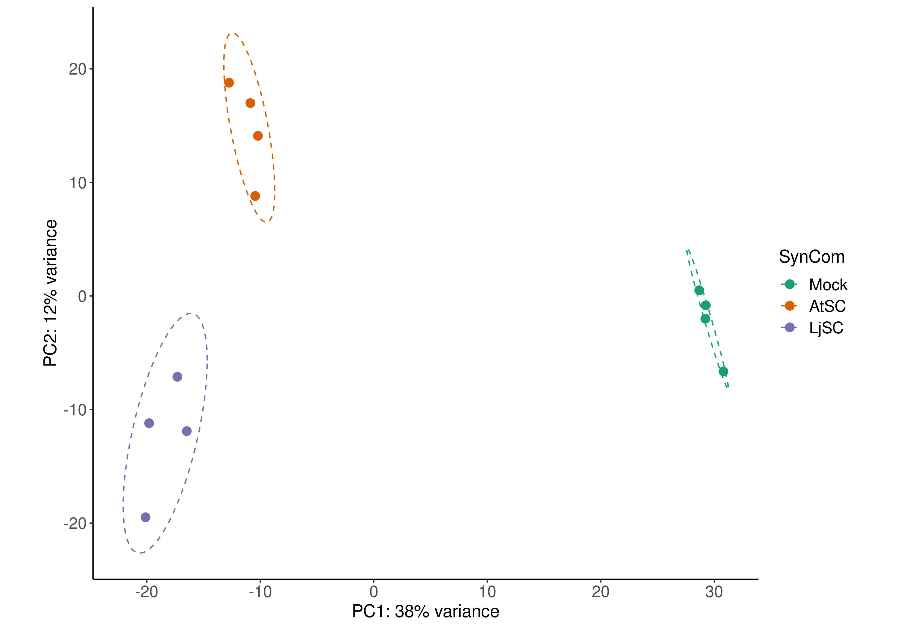

* K-means cluster

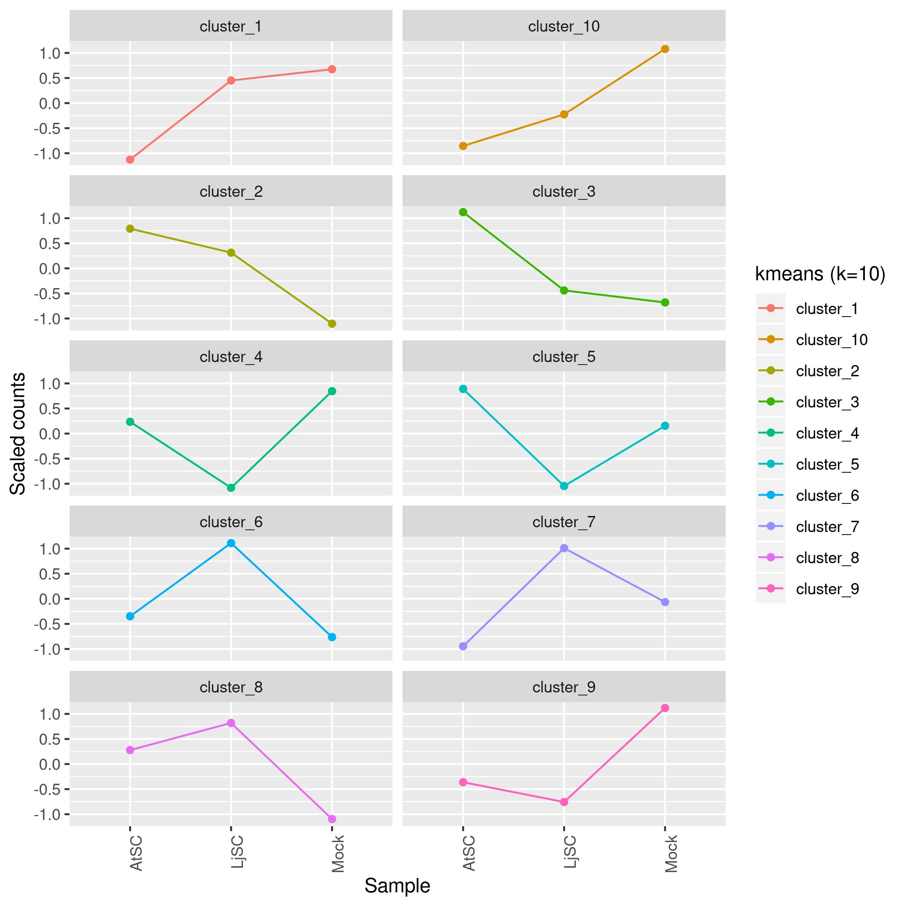

* Heatmap with whole transcriptome

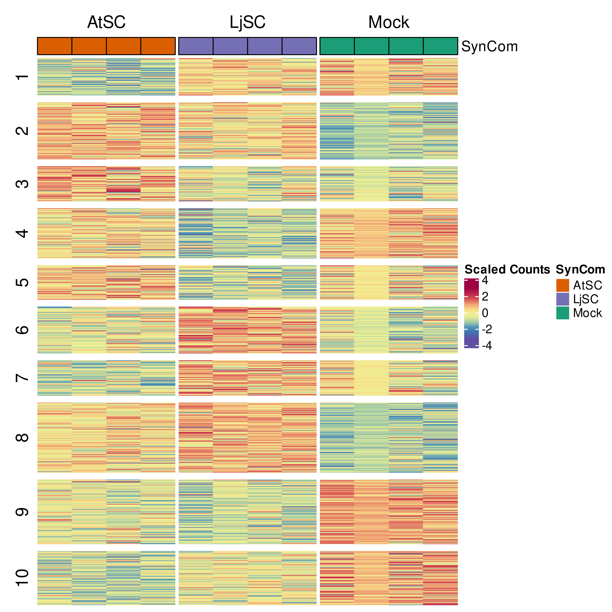

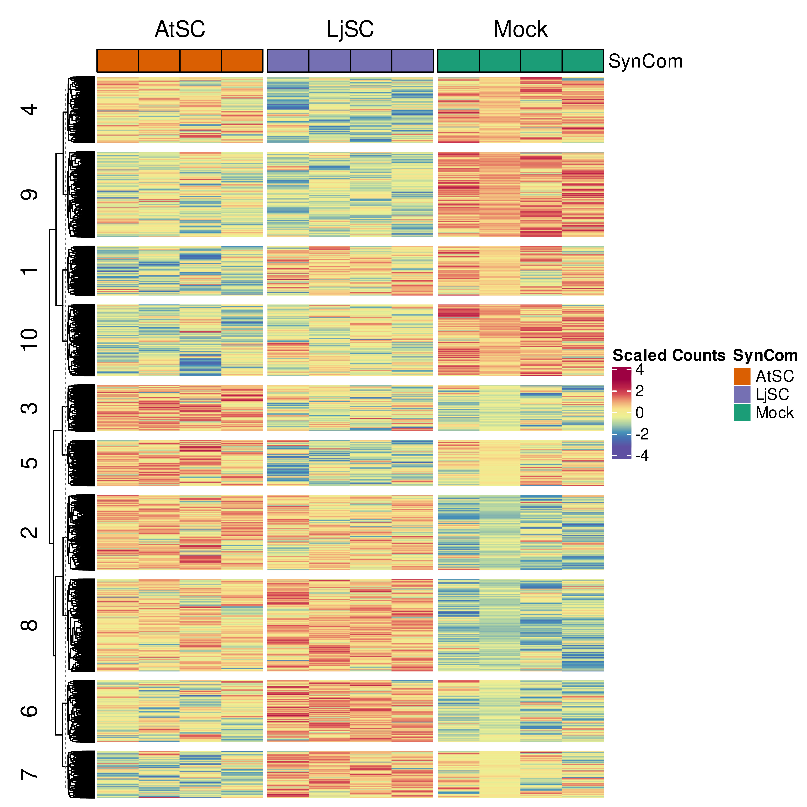

* Heatmap with DEGs

### 3.2 Lotus

*Lotus japonicus* Gifu

* PCA plot

PCA plot of auto sva corrected data

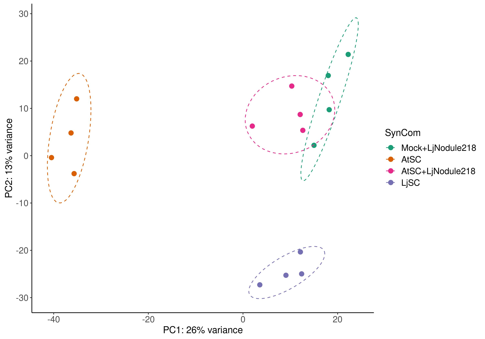

* K-means cluster

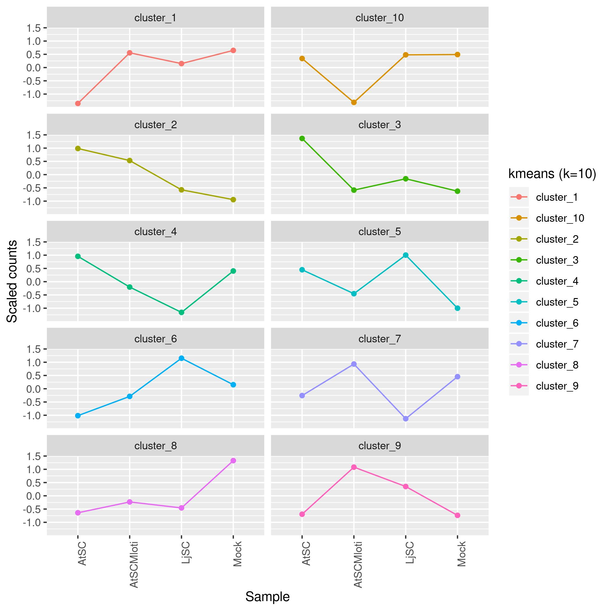

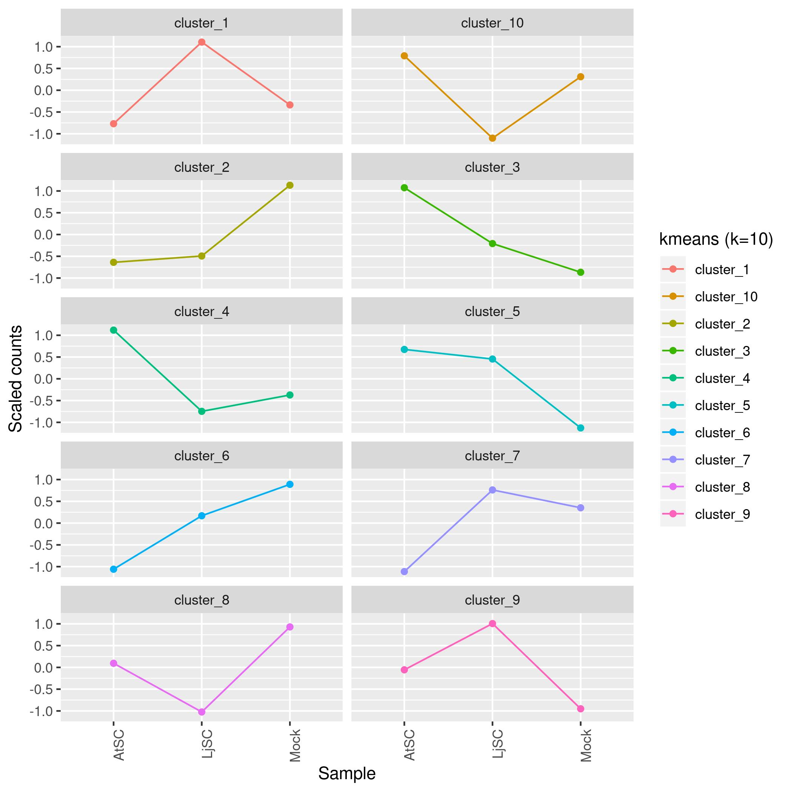

* Heatmap with whole transcriptome

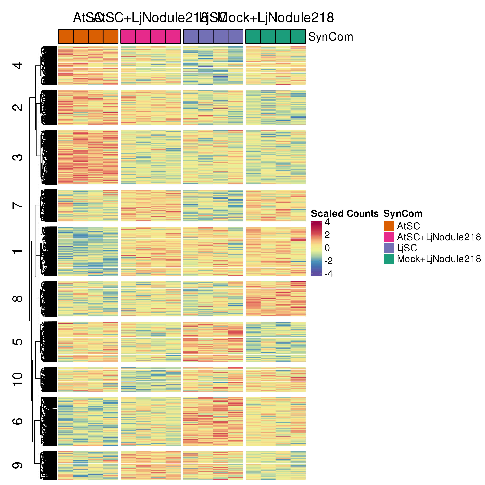

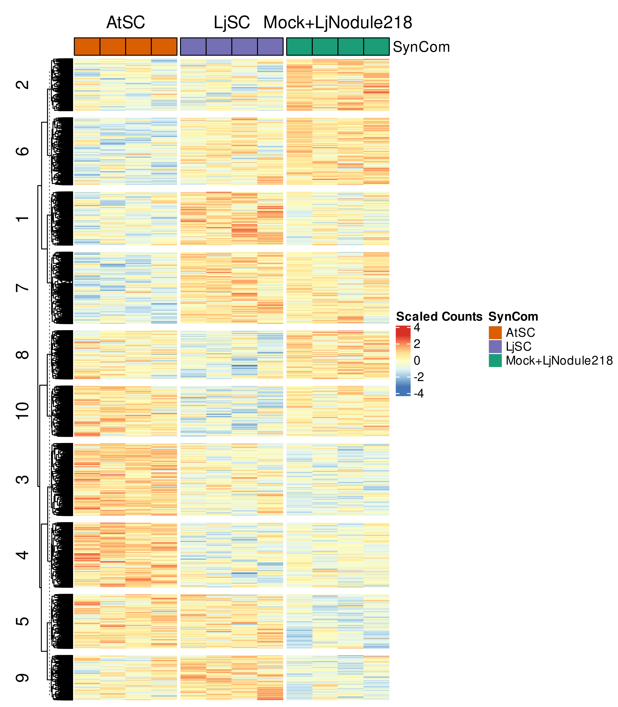

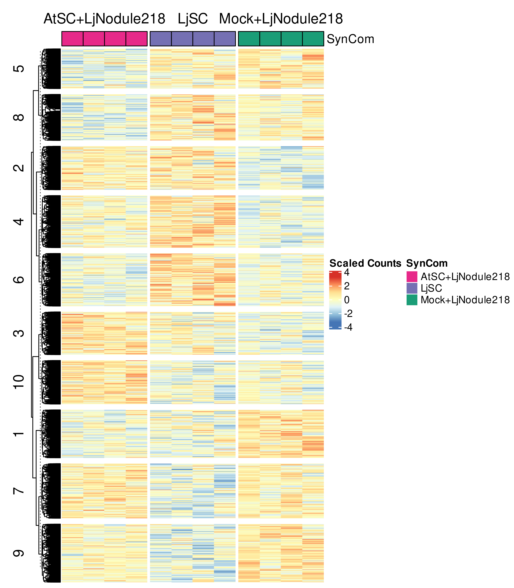

* Heatmap with DEGs

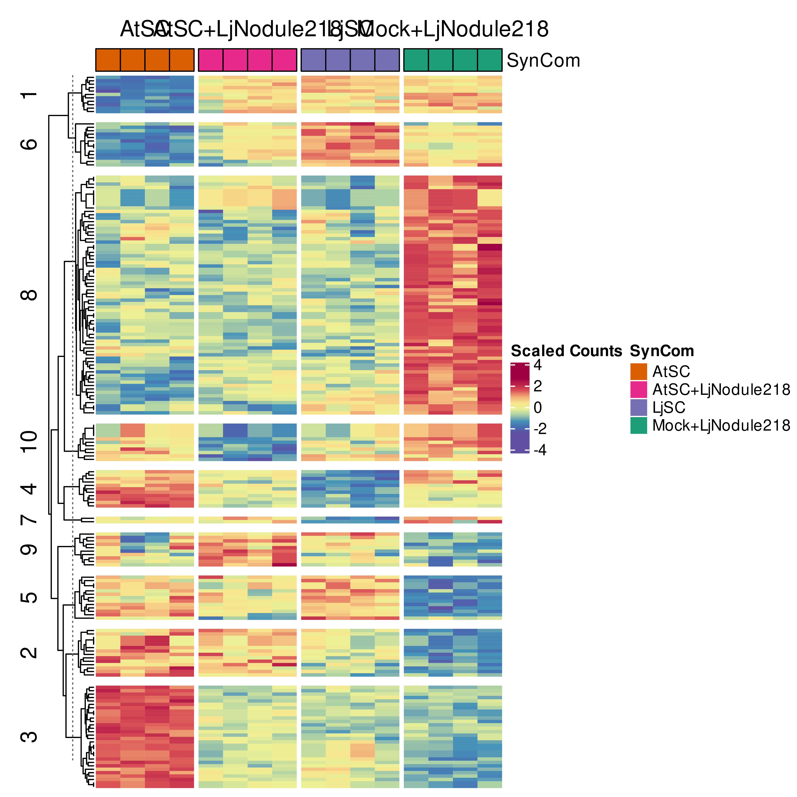
