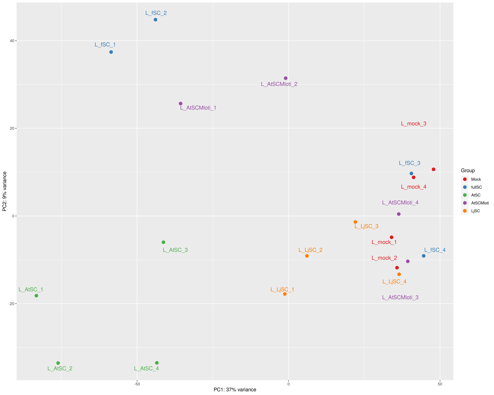
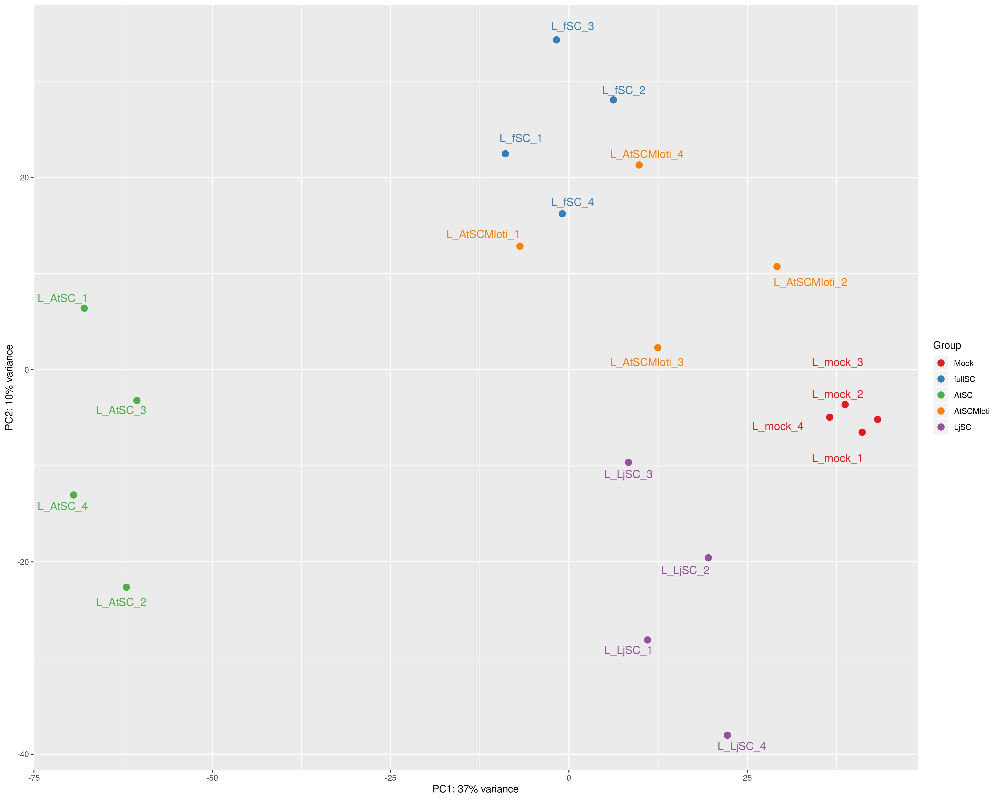

# RNA-Seq data (remove full SynCom) from Kathrin Wippel #

<!-- content start -->

**Table of Contents**

- [1. Cluster](#3-cluster)
    - [1.1 Arabidopsis](#31-arabidopsis)
    - [1.2 Lotus](#32-lotus)
- [References](#references)
    
<!-- content end -->
 
## 1 Cluster

### 1.1 Arabidopsis

*Arabidopsis thaliana* Col-0

* PCA plot

PCA plot of auto sva corrected data


* K-means cluster


* Heatmap


### 3.2 Lotus

*Lotus japonicus* Gifu

* PCA plot

PCA plot of raw data



PCA plot of auto sva corrected data


PCA plot of limma correction data (`1 2` and `3 4`)




* K-means cluster


  


* Trait

```
     fullSC AtSC AtSCMloti LjSC LjNodule218
        1    0         0    0           1
        0    1         0    0           0
        0    0         1    0           1
        0    0         0    1           1
        0    0         0    0           1
```


* Heatmap


