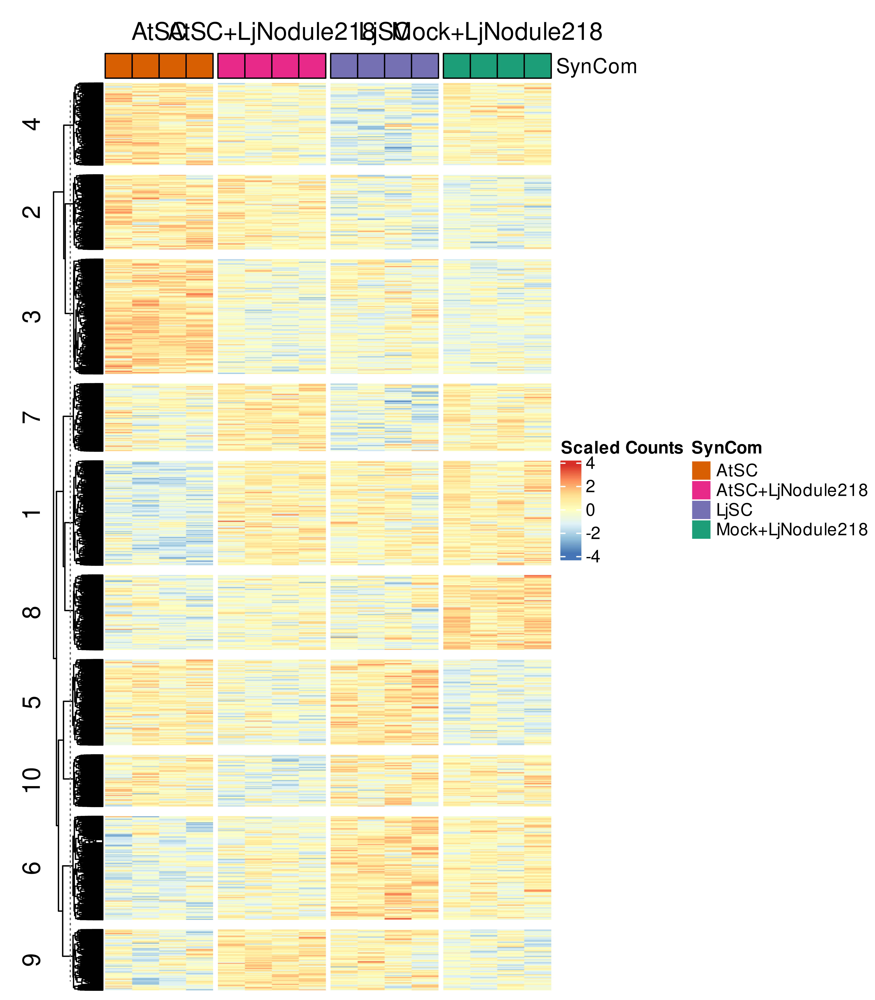
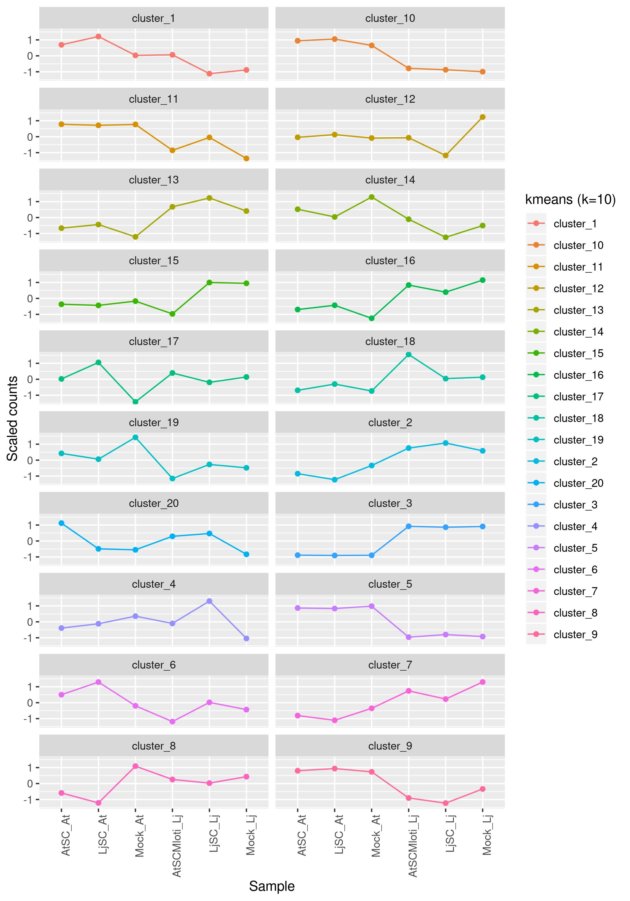
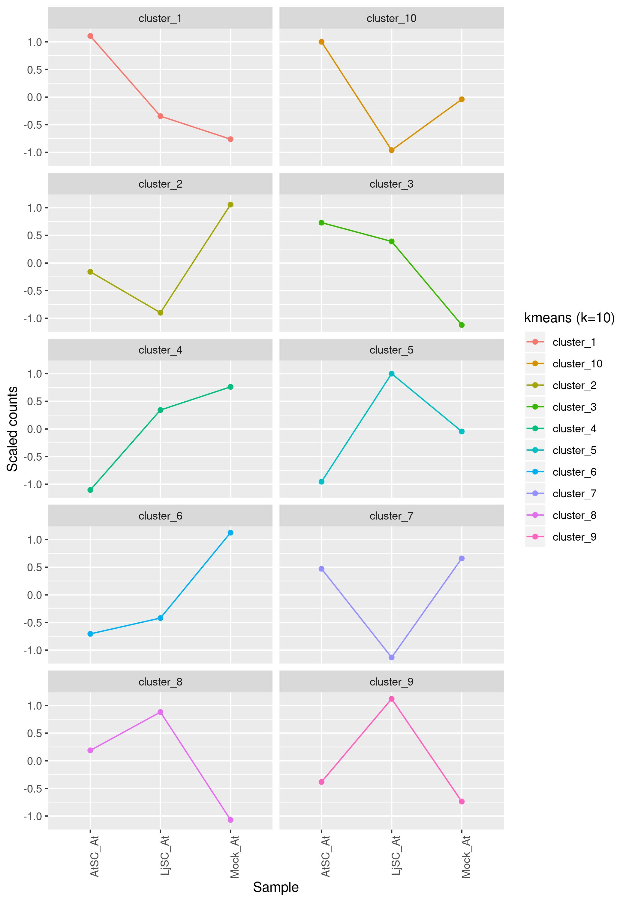

# RNA-Seq data (remove full SynCom) from Kathrin Wippel #

<!-- content start -->

**Table of Contents**

- [1. Cluster](#1-cluster)
    - [1.1 Arabidopsis](#11-arabidopsis)
    - [1.2 Lotus](#12-lotus)
- [2. Orthology mapping](#2-orthology-mapping)
    - [2.1 Orthogroup](#21-orthogroup)
    - [2.2 TAIR Best hit](#22-tair-best-hit)
    - [2.3 PCA plot](#23-pca-plot)
    - [2.4 k-means cluster](#24-k-means-cluster)
- [References](#references)
    
<!-- content end -->
 
## 1 Cluster

### 1.1 Arabidopsis

*Arabidopsis thaliana* Col-0

* PCA plot

PCA plot of auto sva corrected data


* K-means cluster


* Heatmap with whole transcriptome


* Heatmap with DEGs


### 1.2 Lotus

*Lotus japonicus* Gifu

* PCA plot

PCA plot of auto sva corrected data


* K-means cluster


* Heatmap with whole transcriptome




* Heatmap with DEGs


## 2. Orthology mapping

Raw At-transcriptome

```
## number of transcripts for k-means cluster
25725

## number of transcripts in each cluster

   1    2    3    4    5    6    7    8    9   10 
1981 3022 1865 2659 1830 2478 1882 3711 3431 2866 
```

Raw Lj-transcriptome (collaborator's annotation)

```
## number of transcripts for k-means cluster
24840

## number of transcripts in each cluster

   1    2    3    4    5    6    7    8    9   10 
2476 2246 2207 2689 2051 2718 2821 2379 3001 2252
```

### 2.1 Orthogroup

A total of `12498` orthogroups were detected from Eik's analysis. Each orthogroup contains at least two transcripts, one is from At and the other is from Lj. 

```
# A tibble: 20,152 x 5
   athID       athcl Orthogroup lotusID              lotuscl
   <chr>       <dbl> <chr>      <chr>                  <dbl>
 1 AT2G25730.2     2 OG0001627  LotjaGi1g1v0391000.1      10
 2 AT3G62150.3     8 OG0000909  LotjaGi5g1v0238400.1       9
 3 AT3G62150.3     8 OG0000909  LotjaGi5g1v0238400.2       9
 4 AT3G48060.3     8 OG0001635  LotjaGi1g1v0183300.1       7
 5 AT1G06410.2     8 OG0003173  LotjaGi3g1v0253100.1       9
 6 AT4G31970.1     9 OG0006747  LotjaGi1g1v0349800.1       3
 7 AT3G25820.3     4 OG0000069  LotjaGi4g1v0043400.1       7
 8 AT5G49960.1     8 OG0006150  LotjaGi6g1v0363700.3       1
 9 AT2G25730.3    10 OG0001627  LotjaGi1g1v0391000.1      10
10 AT5G13800.3     8 OG0001729  LotjaGi3g1v0117700.1      10
# … with 20,142 more rows
```

Combine At-transcriptome with orthogroups:

```
## number of transcripts for k-means cluster
20152

## number of transcripts in each cluster

   1    2    3    4    5    6    7    8    9   10 
1564 2452 1470 1943 1414 2032 1513 3011 2465 2288 
```

combine Lj-transcriptome (collaborator's annotation) with orthogroups:

```
## number of transcripts for k-means cluster
20152

## number of transcripts in each cluster

   1    2    3    4    5    6    7    8    9   10 
2131 1698 1731 2251 1545 2241 2453 1837 2471 1794 
```

Intersection of At and Lj clusters:

```
     Lj1 Lj2 Lj3 Lj4 Lj5 Lj6 Lj7 Lj8 Lj9 Lj10
At1  163 125 149 204 124 193 153 147 185  121
At2  288 199 230 245 175 237 295 221 307  255
At3  158 110 146 160 125 171 196 110 170  124
At4  191 171 166 222 139 207 263 170 243  171
At5  145 130 131 153  95 133 222 110 172  123
At6  220 177 160 243 179 224 232 192 253  152
At7  190 119 128 165 110 171 154 154 195  127
At8  314 279 240 324 225 340 375 261 390  263
At9  227 197 213 278 156 283 295 262 288  266
At10 235 191 168 257 217 282 268 210 268  192
```
Jaccard similarity matrix:

```
        Lj1    Lj2    Lj3    Lj4    Lj5    Lj6    Lj7    Lj8    Lj9   Lj10
At1  0.0074 0.0058 0.0069 0.0092 0.0057 0.0087 0.0068 0.0067 0.0082 0.0055
At2  0.0131 0.0092 0.0106 0.0111 0.0081 0.0107 0.0132 0.0102 0.0138 0.0118
At3  0.0071 0.0051 0.0067 0.0072 0.0058 0.0077 0.0087 0.0050 0.0076 0.0057
At4  0.0086 0.0079 0.0076 0.0100 0.0064 0.0093 0.0118 0.0078 0.0109 0.0079
At5  0.0065 0.0060 0.0060 0.0069 0.0044 0.0060 0.0099 0.0050 0.0077 0.0056
At6  0.0100 0.0082 0.0074 0.0110 0.0083 0.0101 0.0104 0.0088 0.0113 0.0070
At7  0.0086 0.0055 0.0059 0.0074 0.0051 0.0077 0.0069 0.0071 0.0087 0.0058
At8  0.0143 0.0129 0.0111 0.0147 0.0105 0.0154 0.0169 0.0120 0.0175 0.0121
At9  0.0103 0.0091 0.0098 0.0126 0.0072 0.0128 0.0132 0.0121 0.0129 0.0123
At10 0.0107 0.0088 0.0077 0.0116 0.0101 0.0128 0.0120 0.0096 0.0120 0.0088
```

### 2.2 TAIR Best hit

Use the `Best_TAIR` annotation, which *may be* the best BLASTp hit of Lj proteins to the TAIR database (At homology of Lj).

```
# A tibble: 24,840 x 1
   Best_TAIR                                                                    
   <chr>                                                                        
 1 AT3G56400.1 WRKY DNA-binding protein 70                                      
 2 AT4G10500.1 2-oxoglutarate (2OG) and Fe(II)-dependent oxygenase superfamily …
 3 AT1G03220.1 Eukaryotic aspartyl protease family protein                      
 4 AT4G36090.2 oxidoreductase, 2OG-Fe(II) oxygenase family protein              
 5 AT4G08290.1 nodulin MtN21 /EamA-like transporter family protein              
 6 AT3G56400.1 WRKY DNA-binding protein 70          
```

```
| ID                   | Gene               | Chromosome |   Start |     End | Strand | Interpro_ID                                                                                                                                                  | Ontology_ID                                                                                                                          | Best_TAIR                                                                        |
|----------------------|--------------------|------------|---------|---------|--------|--------------------------------------------------------------------------------------------------------------------------------------------------------------|--------------------------------------------------------------------------------------------------------------------------------------|----------------------------------------------------------------------------------|
| LotjaGi0g1v0000100.1 | LotjaGi0g1v0000100 | chr0       |  777410 |  779794 | +      | IPR015424 (Pyridoxal phosphate-dependent transferase)                                                                                                        | GO:0003824                                                                                                                           | AT5G51920.1 Pyridoxal phosphate (PLP)-dependent transferases superfamily protein |
| LotjaGi0g1v0000200.1 | LotjaGi0g1v0000200 | chr0       | 1083521 | 1087800 | +      | "IPR011043 (Galactose oxidase/kelch, beta-propeller), IPR017665 (Guanylate kinase), IPR027417 (P-loop containing nucleoside triphosphate hydrolase)"         | "GO:0004385, GO:0006163, GO:0016301, GO:0016310, GO:0016740, GO:0046037, GO:0046710"                                                 | AT3G57550.1 guanylate kinase                                                     |
| LotjaGi0g1v0000200.2 | LotjaGi0g1v0000200 | chr0       | 1083550 | 1087644 | +      |                                                                                                                                                              | "GO:0004385, GO:0006163, GO:0016301, GO:0016310, GO:0016740, GO:0046037, GO:0046710"                                                 | AT3G57550.1 guanylate kinase                                                     |
| LotjaGi0g1v0000300.1 | LotjaGi0g1v0000300 | chr0       | 1134471 | 1142062 | +      | "IPR006298 (GTP-binding protein TypA), IPR009000 (Translation protein, beta-barrel domain), IPR027417 (P-loop containing nucleoside triphosphate hydrolase)" | "GO:0000166, GO:0003746, GO:0003924, GO:0005525, GO:0005886, GO:0006412, GO:0006414, GO:0016020, GO:0016787, GO:0043022, GO:0045727" | AT5G13650.1 elongation factor family protein                                     |
| LotjaGi0g1v0000400.1 | LotjaGi0g1v0000400 | chr0       | 1142297 | 1147244 | +      | "IPR011009 (Protein kinase-like domain), IPR011992 (EF-hand domain pair)"                                                                                    |                                                                                                                                      | AT5G19450.1 calcium-dependent protein kinase 19                                  |
| LotjaGi0g1v0000400.2 | LotjaGi0g1v0000400 | chr0       | 1142421 | 1146691 | +      | "IPR011009 (Protein kinase-like domain), IPR011992 (EF-hand domain pair)"                                                                                    |                                                                                                                                      | AT3G57530.1 calcium-dependent protein kinase 32                                  |
| LotjaGi0g1v0000400.3 | LotjaGi0g1v0000400 | chr0       | 1142462 | 1146687 | +      | "IPR011009 (Protein kinase-like domain), IPR011992 (EF-hand domain pair)"                                                                                    |                                                                                                                                      | AT3G57530.1 calcium-dependent protein kinase 32                                  |
| LotjaGi0g1v0000500.1 | LotjaGi0g1v0000500 | chr0       | 1152494 | 1157753 | +      | "IPR000743 (Glycoside hydrolase, family 28), IPR011050 (Pectin lyase fold/virulence factor)"                                                                 | "GO:0004650, GO:0005576, GO:0005975, GO:0008152, GO:0016787, GO:0016798, GO:0016829, GO:0071555"                                     | AT3G57510.1 Pectin lyase-like superfamily protein                                |
| LotjaGi0g1v0000600.1 | LotjaGi0g1v0000600 | chr0       | 1444172 | 1444685 | -      | IPR008395 (Agenet-like domain)                                                                                                                               |                                                                                                                                      | AT1G06340.1 Plant Tudor-like protein                                             |
| LotjaGi0g1v0000700.1 | LotjaGi0g1v0000700 | chr0       | 1490137 | 1491128 | +      | IPR008395 (Agenet-like domain)                                                                                                                               |                                                                                                                                      | AT1G06340.1 Plant Tudor-like protein                                             |
| LotjaGi0g1v0000800.1 | LotjaGi0g1v0000800 | chr0       | 1504361 | 1505355 | +      | IPR008395 (Agenet-like domain)                                                                                                                               |                                                                                                                                      | AT1G06340.1 Plant Tudor-like protein                                             |
```

The merged cluster and annotation table is:

```
# A tibble: 20,455 x 4
   athID       athcl lotusID              lotuscl
   <chr>       <dbl> <chr>                  <dbl>
 1 AT2G25730.2     2 LotjaGi1g1v0391000.1      10
 2 AT4G31970.1     9 LotjaGi3g1v0092600.1       7
 3 AT5G49960.1     8 LotjaGi1g1v0800800.1       1
 4 AT5G49960.1     8 LotjaGi1g1v0800800.5       7
 5 AT5G49960.1     8 LotjaGi6g1v0363700.1       3
 6 AT5G49960.1     8 LotjaGi6g1v0363700.3       1
 7 AT5G13800.3     8 LotjaGi3g1v0117700.1      10
 8 AT5G13800.3     8 LotjaGi3g1v0117700.2      10
 9 AT4G02570.1     2 LotjaGi6g1v0248100.1       3
10 AT4G02570.1     2 LotjaGi6g1v0248100.5       3
# … with 20,445 more rows
```

Combine At-transcriptome with best TAIR hit:

```
## number of transcripts for k-means cluster
20455

## number of transcripts in each cluster

   1    2    3    4    5    6    7    8    9   10 
1546 2568 1519 1972 1317 2258 1603 3267 2364 2041 
```

combine Lj-transcriptome (collaborator's annotation) with best TAIR hit:

```
## number of transcripts for k-means cluster
20455

## number of transcripts in each cluster

   1    2    3    4    5    6    7    8    9   10 
2079 1830 1841 2229 1672 2280 2338 1851 2456 1879 
```

Intersection of At and Lj clusters:

```
     Lj1 Lj2 Lj3 Lj4 Lj5 Lj6 Lj7 Lj8 Lj9 Lj10
At1  154 117 144 210 121 179 151 144 180  146
At2  253 232 244 269 206 248 315 211 316  274
At3  168 128 154 156 118 149 184 108 202  152
At4  192 203 165 232 149 220 248 168 217  178
At5  128 133 126 129 102 144 158 112 158  127
At6  242 206 220 253 179 249 251 218 261  179
At7  170 127 138 177 133 205 173 155 190  135
At8  340 298 283 326 297 354 383 275 412  299
At9  223 213 210 262 176 276 251 266 280  207
At10 209 173 157 215 191 256 224 194 240  182
```

Jaccard similarity:

```
        Lj1    Lj2    Lj3    Lj4    Lj5    Lj6    Lj7    Lj8    Lj9   Lj10
At1  0.0069 0.0053 0.0065 0.0093 0.0055 0.0079 0.0067 0.0065 0.0079 0.0066
At2  0.0114 0.0105 0.0111 0.0120 0.0094 0.0110 0.0140 0.0095 0.0140 0.0124
At3  0.0075 0.0058 0.0070 0.0069 0.0054 0.0066 0.0081 0.0049 0.0089 0.0069
At4  0.0086 0.0092 0.0075 0.0103 0.0068 0.0098 0.0110 0.0076 0.0096 0.0080
At5  0.0057 0.0060 0.0057 0.0057 0.0046 0.0064 0.0070 0.0050 0.0069 0.0057
At6  0.0109 0.0093 0.0100 0.0113 0.0082 0.0111 0.0111 0.0099 0.0115 0.0081
At7  0.0076 0.0057 0.0062 0.0079 0.0060 0.0091 0.0076 0.0070 0.0084 0.0061
At8  0.0153 0.0136 0.0129 0.0146 0.0136 0.0158 0.0171 0.0125 0.0183 0.0136
At9  0.0100 0.0097 0.0095 0.0117 0.0080 0.0123 0.0111 0.0121 0.0124 0.0094
At10 0.0094 0.0078 0.0071 0.0096 0.0087 0.0114 0.0099 0.0088 0.0106 0.0082
```

### 2.3 PCA plot

Full sample PCA plot


remove full SynCom PCA plot


### 2.4 k-means cluster







