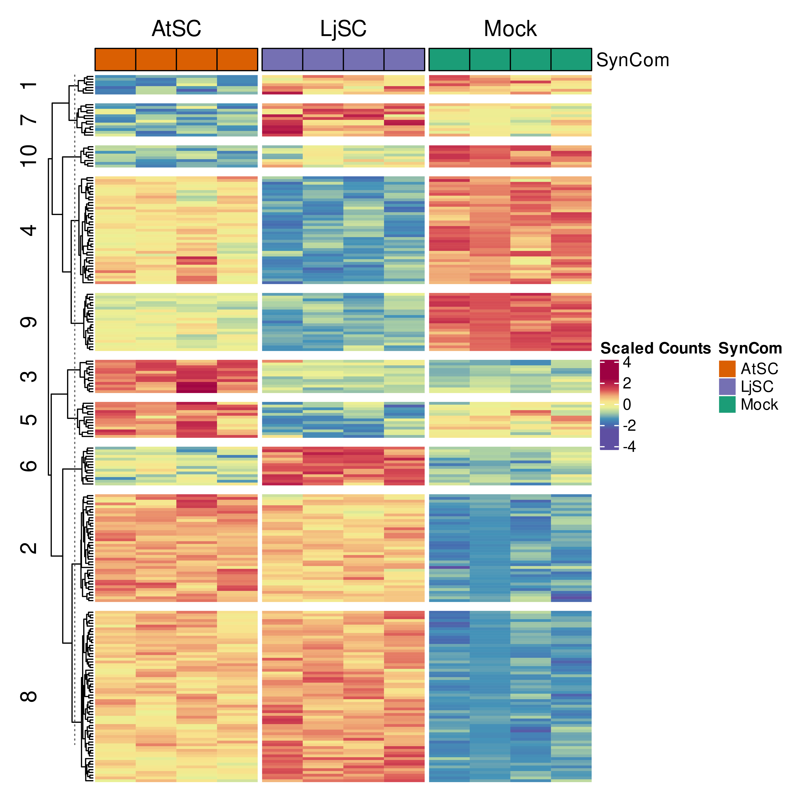
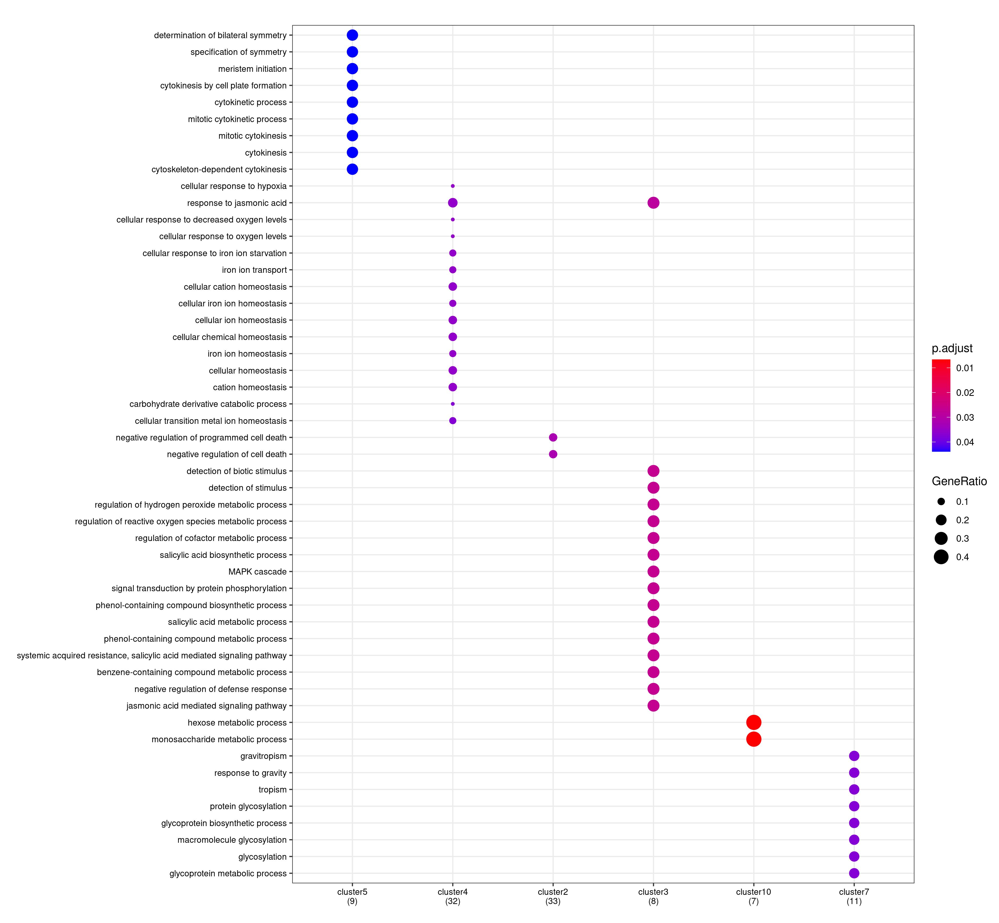
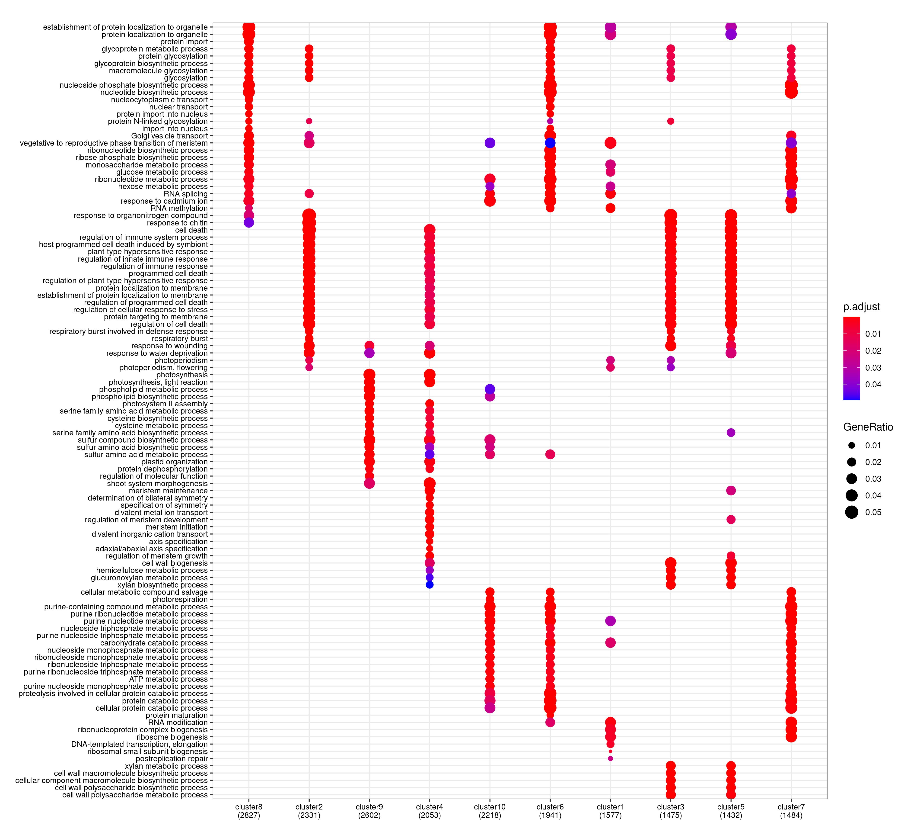

# Compare clusters (remove full SynCom) with Ka-Wai's flowpot #

<!-- content start -->

**Table of Contents**

- [1. Cluster](#1-cluster)
    - [1.1 DEGs](#11-degs)
    - [1.2 All genes](#12-all-genes)
<!-- content end -->

## 1. Cluster

### 1.1 DEGs

* Kathrin



* Ka-Wai


* GO BP enrichment



```
         Paulo1 Paulo2 Paulo3 Paulo4 Paulo5 Paulo6 Paulo7 Paulo8 Paulo9 Paulo10
Ka-Wai1       0      0      0      0      0      0      0      0      0       0
Ka-Wai2       0      0      0      0      0      0      0      0      0       0
Ka-Wai3       0      0      0      0      0      0      0      0      0       0
Ka-Wai4       0      0      0      0      0      0      0      0      0       0
Ka-Wai5       0      0      0      0      0      0      0      0      0       0
Ka-Wai6       0      0      0      0      0      0      0      0      0       0
Ka-Wai7       0      0      0      0      0      0      0      0      0       0
Ka-Wai8       0      0      0      0      0      0      0      0      0       0
Ka-Wai9       0      0      0      0      0      0      0      0      0       0
Ka-Wai10      0      0      0      0      0      0      0      0      0       0
```

### 1.2 All genes

* GO BP enrichment



```
         Paulo1 Paulo2 Paulo3 Paulo4 Paulo5 Paulo6 Paulo7 Paulo8 Paulo9 Paulo10
Ka-Wai1       0      0      0      0      0      0      0      0      0       0
Ka-Wai2       0      0      0      0      0      0      0      0      0       0
Ka-Wai3       0      0      0      0      0      0      0      0      0       0
Ka-Wai4       0      0      0      0      0      0      0      0      0       0
Ka-Wai5       0      0      0      0      0      0      0      0      0       0
Ka-Wai6       0      0      0      0      0      0      0      0      0       0
Ka-Wai7       0      0      0      0      0      0      0      0      0       0
Ka-Wai8       0      0      0      0      0      0      0      0      0       0
Ka-Wai9       0      0      0      0      0      0      0      0      0       0
Ka-Wai10      0      0      0      0      0      0      0      0      0       0
```


