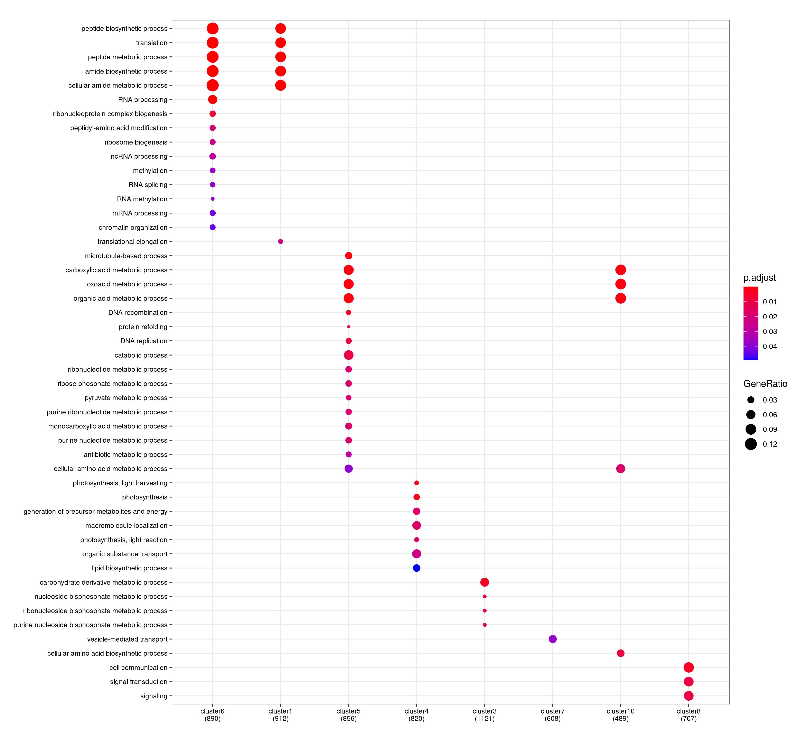
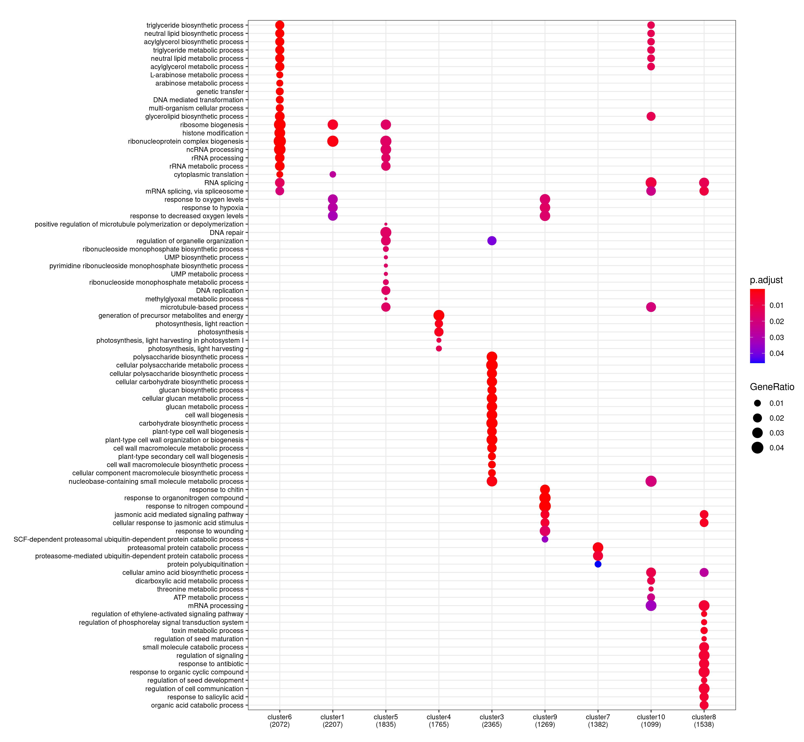
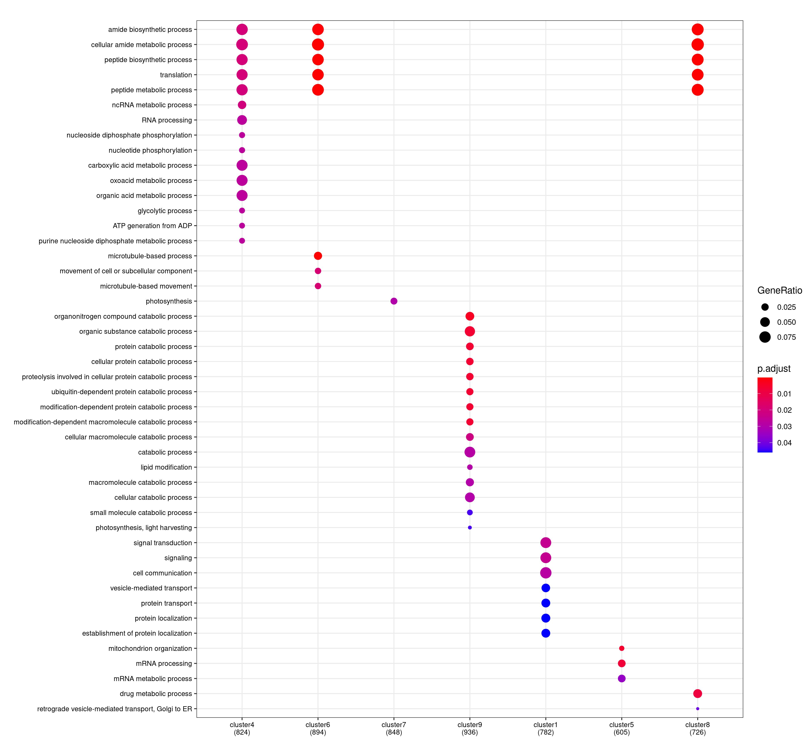
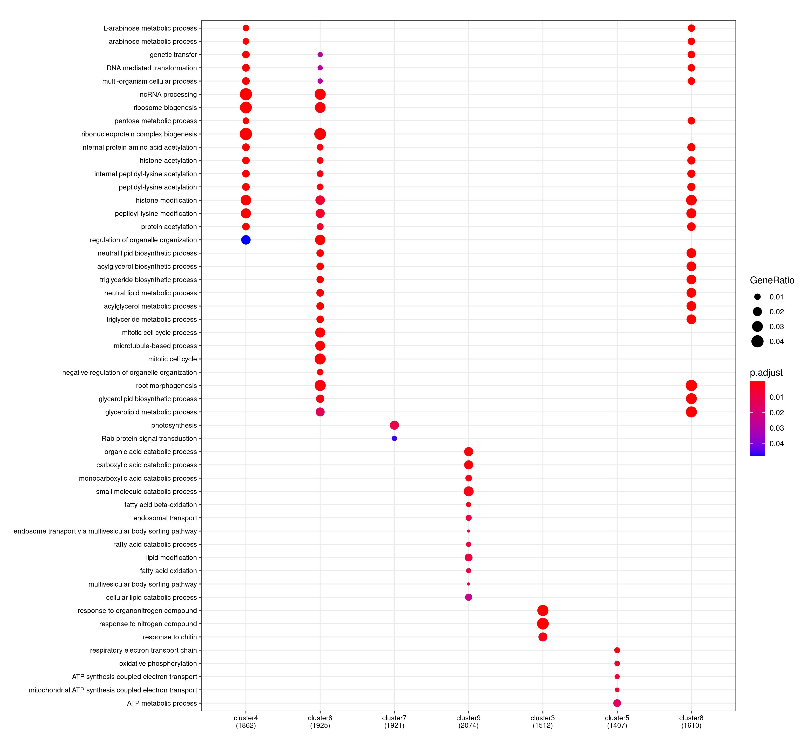

# Compare clusters (remove full SynCom) with Ka-Wai's flowpot #

<!-- content start -->

**Table of Contents**

- [1. ClusterAt](#1-clusterat)
    - [1.1 DEGs](#11-degs)
    - [1.2 All genes](#12-all-genes)
- [2. ClusterLj](#1-clusterlj)
    - [2.1 Remove fullSynCom](#21-remove-fullsyncom)
    - [2.2 Remove fullSynCom AtSynCom](#22-remove-fullsyncom-atsyncom)
<!-- content end -->

## 1. ClusterAt

### 1.1 DEGs

* Kathrin


* Ka-Wai


* GO BP enrichment


```
         Kathrin1 Kathrin2 Kathrin3 Kathrin4 Kathrin5 Kathrin6 Kathrin7 Kathrin8 Kathrin9 Kathrin10
Ka-Wai1       0      0      0      0      0      0      0      0      0       0
Ka-Wai2       0      0      0      0      0      0      0      0      0       0
Ka-Wai3       0      0      0      0      0      0      0      0      0       0
Ka-Wai4       0      0      0      0      0      0      0      0      0       0
Ka-Wai5       0      0      0      0      0      0      0      0      0       0
Ka-Wai6       0      0      0      0      0      0      0      0      0       0
Ka-Wai7       0      0      0      0      0      0      0      0      0       0
Ka-Wai8       0      0      0      0      0      0      0      0      0       0
Ka-Wai9       0      0      0      0      0      0      0      0      0       0
Ka-Wai10      0      0      0      0      0      0      0      0      0       0
```

### 1.2 All genes

* GO BP enrichment


```
         Kathrin1 Kathrin2 Kathrin3 Kathrin4 Kathrin5 Kathrin6 Kathrin7 Kathrin8 Kathrin9 Kathrin10
Ka-Wai1       0      0      0      0      0      0      0      0      0       0
Ka-Wai2       0      0      0      0      0      0      0      0      0       0
Ka-Wai3       0      0      0      0      0      0      0      0      0       0
Ka-Wai4       0      0      0      0      0      0      0      0      0       0
Ka-Wai5       0      0      0      0      0      0      0      0      0       0
Ka-Wai6       0      0      0      0      0      0      0      0      0       0
Ka-Wai7       0      0      0      0      0      0      0      0      0       0
Ka-Wai8       0      0      0      0      0      0      0      0      0       0
Ka-Wai9       0      0      0      0      0      0      0      0      0       0
Ka-Wai10      0      0      0      0      0      0      0      0      0       0
```

## 2. ClusterLj

### 2.1 Remove fullSynCom

* Heatmap with DEGs


* GO BP enrichment with raw GO anno




* GO BP enrichment with besthit GO anno



### 2.2 Remove fullSynCom AtSynCom

* Heatmap with DEGs


* GO BP enrichment with GO anno




* GO BP enrichment with besthit GO anno


